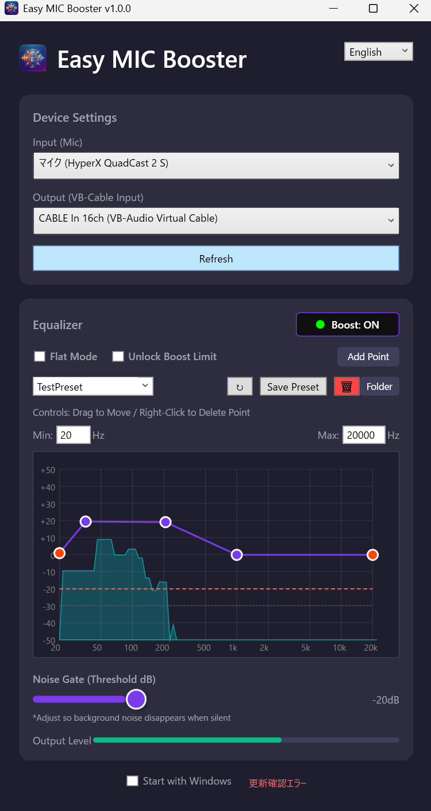

# Easy MIC Booster - Audio Routing & Gain Tool

[English](#english) | [日本語](#japanese)

---

## English

A tool for amplifying microphone volume at the system level and performing high-quality audio processing.
It uses NAudio to capture microphone input, processes it through DSPs such as Noise Gate, Equalizer, and Limiter, and outputs it to a virtual audio device like VB-Cable.

### Key Features
- **Software Amplifier**: Eliminates microphone gain shortage.
- **Noise Gate**: Cuts ambient noise and keyboard sounds.
- **Equalizer**: Detailed adjustment of voice quality.
- **Limiter**: Prevents sound clipping.

### Documentation
- **[Documentation Home](docs/en/Home.md)**
    - [User Guide](docs/en/UserGuide.md) (Installation and Usage)
    - [Developer Guide](docs/en/DeveloperGuide.md) (Build and Development)

### Quick Start
1. Install VB-Cable.
2. Download and unzip the release version.
3. Launch `EasyMICBooster.exe`.
4. Select Input (Microphone) and Output (VB-Cable Input).
5. Turn the switch ON.

---

## Japanese (日本語)

マイク音量をシステムレベルで増幅し、高品質な音声処理を行うためのツールです。
NAudioを使用してマイク入力をキャプチャし、ノイズゲート、イコライザー、リミッターなどのDSP処理を経由して、VB-Cable等の仮想オーディオデバイスへ出力します。

### 主な機能
- **ソフトウェアアンプ**: マイクのゲイン不足を解消。
- **ノイズゲート**: 環境音やキーボード音をカット。
- **イコライザー**: 声質の詳細な調整。
- **リミッター**: 音割れ防止。

### ドキュメント
- **[日本語ドキュメントホーム](docs/ja/Home.md)**
    - [ユーザーガイド](docs/ja/UserGuide.md) (インストールと使い方)
    - [開発者ガイド](docs/ja/DeveloperGuide.md) (ビルドと開発)

### クイックスタート
1. VB-Cable をインストール。
2. リリース版をダウンロード・解凍。
3. `EasyMICBooster.exe` を起動。
4. 入力（マイク）と出力（VB-Cable Input）を選択。
5. スイッチをONにする。

## License / ライセンス

MIT License
