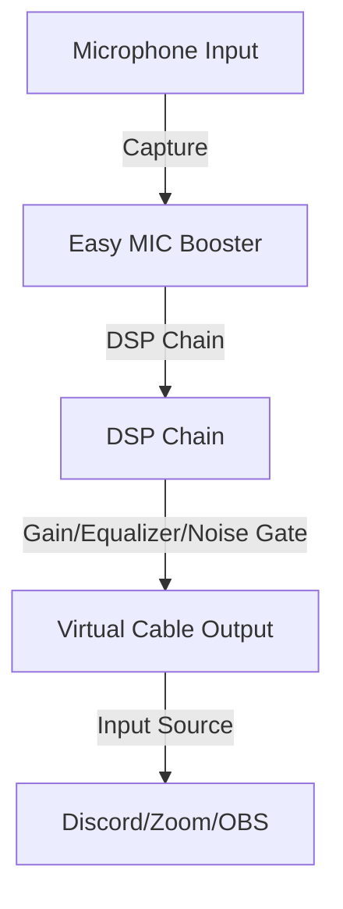

# Easy MIC Booster Documentation

Welcome to the Easy MIC Booster documentation. This tool is an application for providing system-level microphone gain amplification and advanced audio processing.

## Documentation List

### Guides

- **[User Guide](UserGuide.md)**: Installation, initial setup, and basic usage.
- **[Developer Guide](DeveloperGuide.md)**: How to build from source code, project structure.

### Feature Reference

- **[Features & Usage](Features.md)**: Detailed explanation of audio processing features (Noise Gate, Equalizer, Limiter).

## Overview

Easy MIC Booster captures audio from the microphone, processes it with various DSP effects (Gain, Equalizer, Noise Gate, Limiter), and outputs it to a virtual audio device (e.g., VB-Cable). This allows you to use high-quality audio in applications such as Discord and Zoom.

