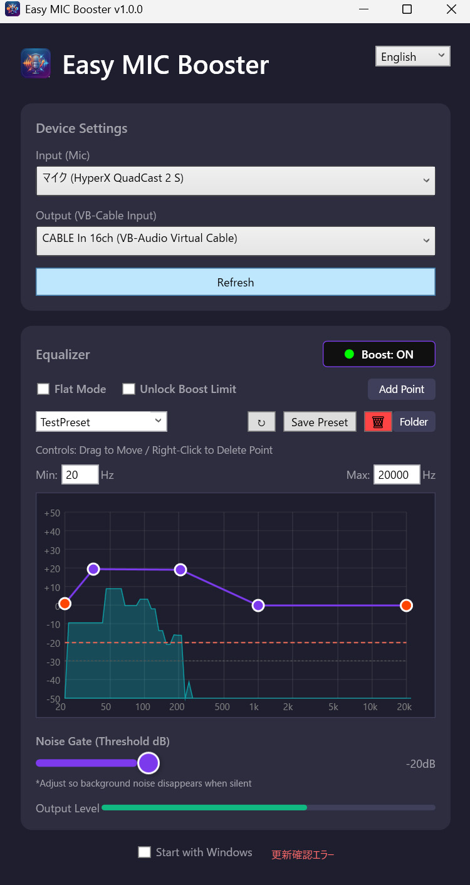

# Easy MIC Booster

Microphone gain amplification & high-quality audio processing for Windows.
{: .fs-6 .fw-300 }

Captures microphone input via NAudio, processes it through Noise Gate, Equalizer, and Limiter, and routes it to a virtual audio device such as VB-CABLE.

[Get Started](user-guide){: .btn .btn-primary .fs-5 .mb-4 .mb-md-0 .mr-2 }
[GitHub](https://github.com/SeiyaFunaokaJP/Easy-MIC-Booster){: .btn .fs-5 .mb-4 .mb-md-0 }



---

## Key Features

- **Software Amplifier** -- eliminates microphone gain shortage at the system level
- **Noise Gate** -- cuts ambient noise and keyboard typing sounds
- **Parametric Equalizer** -- visual graph editing with savable presets
- **Limiter** -- prevents clipping from sudden loud noises
- **Bilingual UI** -- English / Japanese
- **Auto Save** -- device, switches, and EQ are restored on next launch

## How It Works

```
Microphone Input
       │
       ▼
 NAudio Capture (PCM)
       │
       ▼
 DSP Chain (Noise Gate → Equalizer → Limiter → Gain)
       │
       ▼
 Virtual Audio Device (VB-CABLE Input)
       │
       ▼
 Discord / Zoom / OBS / etc.
```

## Quick Start

1. Install [VB-CABLE](https://vb-audio.com/Cable/).
2. Download and unzip the latest release.
3. Launch `EasyMICBooster.exe`.
4. Select your microphone as **Input** and `CABLE Input (VB-Audio Virtual Cable)` as **Output**.
5. Toggle the central switch **ON**.
6. In Discord/Zoom/OBS, select `CABLE Output (VB-Audio Virtual Cable)` as the microphone.

See [User Guide](user-guide) for the full walkthrough.
