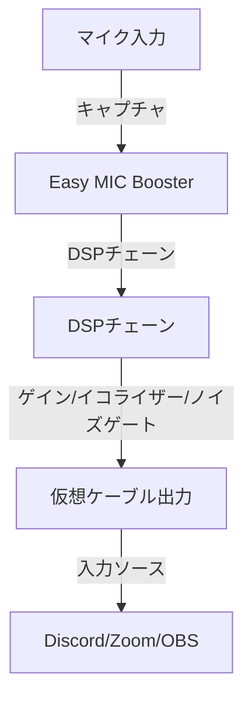

# Easy MIC Booster ドキュメント

Easy MIC Booster ドキュメントへようこそ。このツールは、システムレベルでのマイクゲイン増幅と高度な音声処理を提供するためのアプリケーションです。

## ドキュメント一覧

### ガイド

- **[ユーザーガイド](UserGuide.md)**: インストール、初期設定、基本的な使い方。
- **[開発者ガイド](DeveloperGuide.md)**: ソースコードからのビルド方法、プロジェクト構成。

### 機能解説

- **[機能と使い方](Features.md)**: 音声処理機能（ノイズゲート、イコライザー、リミッター）の詳細解説。

## 概要

Easy MIC Boosterは、マイクからの音声をキャプチャし、各種DSPエフェクト（ゲイン、イコライザー、ノイズゲート、リミッター）で処理した後、仮想オーディオデバイス（例：VB-Cable）へ出力します。これにより、DiscordやZoomなどのアプリケーションで高品質な音声を利用できます。

